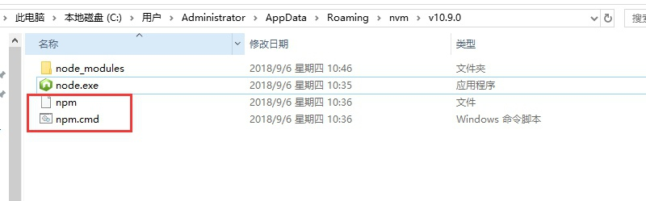

下载地址: [https://github.com/coreybutler/nvm-windows/releases](https://github.com/coreybutler/nvm-windows/releases)

## 使用
### 查看已经安装的版本
```
C:\WINDOWS\system32>nvm list

  * 6.11.3 (Currently using 64-bit executable)
```
### 查看可以安装版本
```
C:\WINDOWS\system32>nvm list available

|   CURRENT    |     LTS      |  OLD STABLE  | OLD UNSTABLE |
|--------------|--------------|--------------|--------------|
|    10.9.0    |    8.11.4    |   0.12.18    |   0.11.16    |
|    10.8.0    |    8.11.3    |   0.12.17    |   0.11.15    |
|    10.7.0    |    8.11.2    |   0.12.16    |   0.11.14    |
|    10.6.0    |    8.11.1    |   0.12.15    |   0.11.13    |
|    10.5.0    |    8.11.0    |   0.12.14    |   0.11.12    |
|    10.4.1    |    8.10.0    |   0.12.13    |   0.11.11    |
|    10.4.0    |    8.9.4     |   0.12.12    |   0.11.10    |
|    10.3.0    |    8.9.3     |   0.12.11    |    0.11.9    |
|    10.2.1    |    8.9.2     |   0.12.10    |    0.11.8    |
|    10.2.0    |    8.9.1     |    0.12.9    |    0.11.7    |
|    10.1.0    |    8.9.0     |    0.12.8    |    0.11.6    |
|    10.0.0    |    6.14.4    |    0.12.7    |    0.11.5    |
|    9.11.2    |    6.14.3    |    0.12.6    |    0.11.4    |
|    9.11.1    |    6.14.2    |    0.12.5    |    0.11.3    |
|    9.11.0    |    6.14.1    |    0.12.4    |    0.11.2    |
|    9.10.1    |    6.14.0    |    0.12.3    |    0.11.1    |
|    9.10.0    |    6.13.1    |    0.12.2    |    0.11.0    |
|    9.9.0     |    6.13.0    |    0.12.1    |    0.9.12    |
|    9.8.0     |    6.12.3    |    0.12.0    |    0.9.11    |
|    9.7.1     |    6.12.2    |   0.10.48    |    0.9.10    |

This is a partial list. For a complete list, visit https://nodejs.org/download/release
```
### 安装指定版本
```
C:\WINDOWS\system32>nvm install 10.9.0 64-bit
```

### 使用指定版本
```
C:\WINDOWS\system32>nvm list

    10.9.0
    6.11.3

C:\WINDOWS\system32>nvm use 10.9.0
Now using node v10.9.0 (64-bit)

C:\WINDOWS\system32>node -v
v10.9.0
```

### 卸载指定版本
```
C:\WINDOWS\system32>nvm uninstall 10.9.0
```

## 安装失败
安装指定版本会把对应的`npm`也装上。某些时候也许你会遇到失败情况，这里就需要手动安装
打开[https://github.com/npm/npm/releases](https://github.com/npm/npm/releases) 
下载对应的npm版本 手动解压到 没有安装npm的版本 `C:\Users\Administrator\AppData\Roaming\nvm`,我这里截图为例


我放到`node-10.9.0`目录下解压，重命名为`npm`
新增2个文件`npm`和`npm.cmd`


`npm`写入内容:
```
#!/bin/sh
(set -o igncr) 2>/dev/null && set -o igncr; # cygwin encoding fix

basedir=`dirname "$0"`

case `uname` in
    *CYGWIN*) basedir=`cygpath -w "$basedir"`;;
esac

NODE_EXE="$basedir/node.exe"
if ! [ -x "$NODE_EXE" ]; then
  NODE_EXE=node
fi

NPM_CLI_JS="$basedir/node_modules/npm/bin/npm-cli.js"

case `uname` in
  *MINGW*)
    NPM_PREFIX=`"$NODE_EXE" "$NPM_CLI_JS" prefix -g`
    NPM_PREFIX_NPM_CLI_JS="$NPM_PREFIX/node_modules/npm/bin/npm-cli.js"
    if [ -f "$NPM_PREFIX_NPM_CLI_JS" ]; then
      NPM_CLI_JS="$NPM_PREFIX_NPM_CLI_JS"
    fi
    ;;
  *CYGWIN*)
    NPM_PREFIX=`"$NODE_EXE" "$NPM_CLI_JS" prefix -g`
    NPM_PREFIX_NPM_CLI_JS="$NPM_PREFIX/node_modules/npm/bin/npm-cli.js"
    if [ -f "$NPM_PREFIX_NPM_CLI_JS" ]; then
      NPM_CLI_JS="$NPM_PREFIX_NPM_CLI_JS"
    fi
    ;;
esac

"$NODE_EXE" "$NPM_CLI_JS" "$@"

```

`npm.cmd`写入内容
```
:: Created by npm, please don't edit manually.
@ECHO OFF

SETLOCAL

SET "NODE_EXE=%~dp0\node.exe"
IF NOT EXIST "%NODE_EXE%" (
  SET "NODE_EXE=node"
)

SET "NPM_CLI_JS=%~dp0\node_modules\npm\bin\npm-cli.js"
FOR /F "delims=" %%F IN ('CALL "%NODE_EXE%" "%NPM_CLI_JS%" prefix -g') DO (
  SET "NPM_PREFIX_NPM_CLI_JS=%%F\node_modules\npm\bin\npm-cli.js"
)
IF EXIST "%NPM_PREFIX_NPM_CLI_JS%" (
  SET "NPM_CLI_JS=%NPM_PREFIX_NPM_CLI_JS%"
)

"%NODE_EXE%" "%NPM_CLI_JS%" %*

```

最后查看一下版本
```
C:\WINDOWS\system32>nvm use 10.9.0
Now using node v10.9.0 (64-bit)

C:\WINDOWS\system32>npm -v
6.2.0-next.1
```
完事