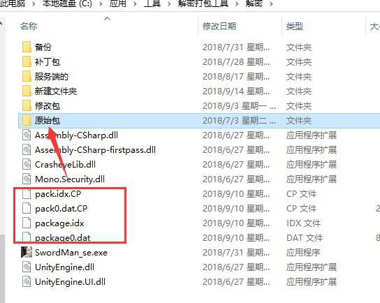
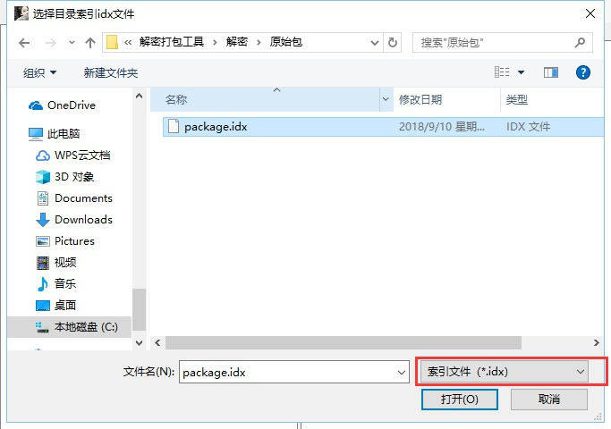
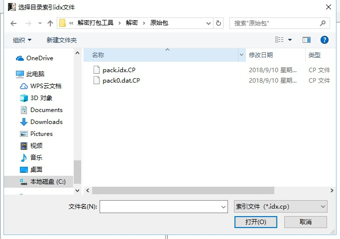

剑侠核心文件
0WQK.png)
分别放在

`/home/jxqy`和 `www/wwwroot/xxxx.xxx/jxqy/android`


## 解密



这4个文件放到原始包里面
第一次选择


要选择2次
第二次选择 idx.cp


`Setting`目录介绍大全
```
Achievement 成就
Activity 活动
  |—— Idioms 成语
Auction 拍卖
    |——DealerItems 行脚商物品刷出
Battle 战场
Calendar 日历
|——ActivityReward 活动奖励
|——ActivityTip 活动提醒文字
CardPicker 卡片选择器
Chat 聊天
ClientNpc 客户端NPC
CollectionSystem 收集系统
Decoration 装饰
Exchange 交换
Faction 门派 
FriendShip 好友亲密度
Fuben 副本
Gift 礼品
Help 帮助
HeroChallenge 英雄挑战
House 房子
HousePlant 室内植物
HuaShanLunJian 华山论剑
ImperialTomb 秦始皇陵墓
Item 项目
JingMai 经脉
JuanZhou 卷轴
Kin 亲密
Map 地图
MarketStall 摆摊
MissionAward 使命奖
NewInformation 新的信息
NPC
|——DropFile
            |—— WhiteTigerFuben 白虎堂
Partner 伙伴
Player 播放
Pray 祈祷
QuickBuy 快速购买
RandomBoss 野外随机boss
RankBattle 排名战
shop 商城
skill 技能
Task 任务
TeacherStudent 师徒
UI 界面的ui
WelfareActivity 福利活动
WuLinDaHui 武林大会
```