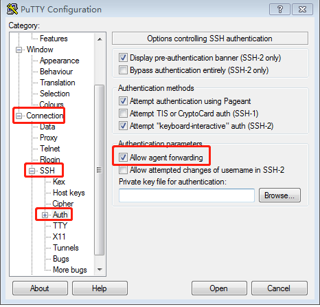
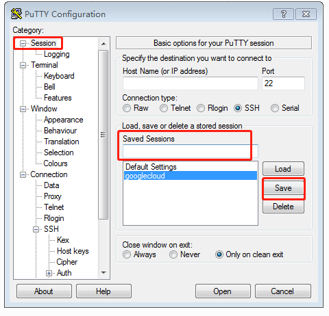
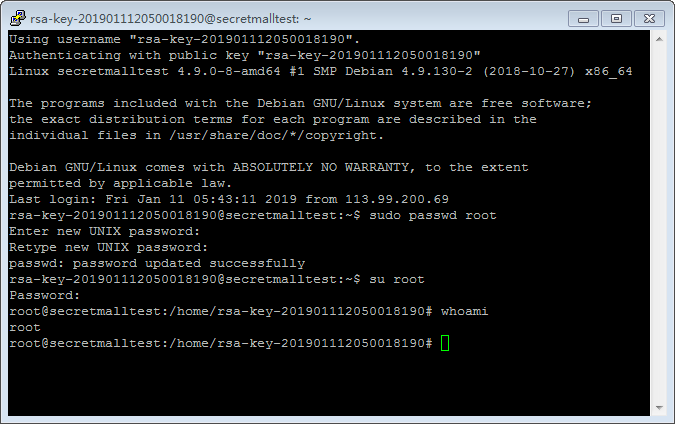
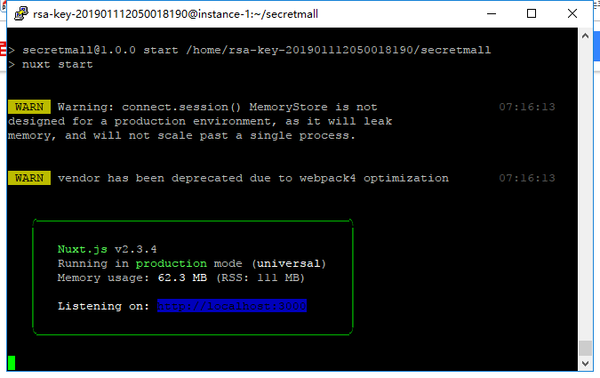
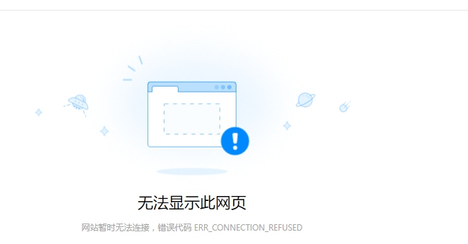
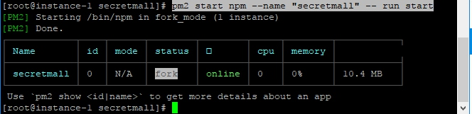

# 记得一次部署到linux踩的坑

google云服务器，选的centos7系统。

## 连接
用到`PuTTY`，[下载地址](https://www.chiark.greenend.org.uk/~sgtatham/putty/latest.html)
生成公钥 + 私钥
打开PuTTY，上传私钥


在这里记住要保存一个sessions，那以后就不需要每次启动都上传私钥了，只需要双击一下自己已经保存的session就可以登陆了，我这里把session命名为了googlecloud



需要连接，每次双击googlecloud就可以


输入设置好的密码，完事

## 部署的坑
### node的安装
`Vue`写的项目，需要用到`node`. 安装node。
node安装很简单，上网一搜一大堆。我也是一样 
1. 在node官网下载linux安装包
2. 丢到自定义的一个路径
3. 然后解压 `tar -xvf   node-v10.xxx`
4. 然后建立软连接
问题就是出在，建立软连接，上网查看的资料是` /usr/local/bin/` 。然后也按照教程一般无二的执行。
提示各种各种的错误，硬是没成功，添加`sudo`还是不成。
然后想到查一下`path`的地址。输入`echo $PATH` 
给我的结果是`/usr/bin/`。这就很尴尬
给无知的我好好上了一课

### 部署，启动项目？
node安装好了，美滋滋，那就是启动项目
形如流水、英俊潇洒的输完`npm run build`

完美的编译。
在启动服务`npm run start`


ok,准备迎接我人生的巅峰


在浏览器输入外网IP + 端口 xxxxxxx:3000 ，一按回车，已经想到那一种nice


我擦(X*U^$(*(^$&*)。居然无法访问。这明明是已经正确的启动了。
然后登陆google云查看防火墙安全策略，端口已经全部开放了啊。

尝试了很多方法，没有想到自己有错，一直在原地兜圈，然后尝试把端口改成80试试
一启动提示我 `listen EACCES: permission denied 0.0.0.0:80`. 凉波波的
想到没权限，那么我就重新打开服务，输入`sudo -s` 。在执行往上同样的操作
这次总算是能打开，部署好了。

## 用pm2来守护程序
嗯，这里没什么好说的，备忘记录下
启动nuxt项目。
`pm2 start npm --name "secretmall" -- run start`


完美


### pm2的常用命令
#### 查看进程
```
pm2 list
pm2 show 0 或者 # pm2 info 0         #查看进程详细信息，0为PM2进程id 
```
#### 监控：
```
pm2 monit
```
#### 停止
```
pm2 stop all                         #停止PM2列表中所有的进程
pm2 stop 0                           #停止PM2列表中进程为0的进程
```
#### 重载
```
pm2 reload all                       #重载PM2列表中所有的进程
pm2 reload 0                         #重载PM2列表中进程为0的进程
```
#### 重启
```
pm2 restart all                      #重启PM2列表中所有的进程
pm2 restart 0                        #重启PM2列表中进程为0的进程
```
#### 删除PM2进程
```
pm2 delete 0                         #删除PM2列表中进程为0的进程
pm2 delete all                       #删除PM2列表中所有的进程
```
#### 日志操作
```
pm2 logs [--raw]                     #Display all processes logs in streaming
pm2 flush                            #Empty all log file
pm2 reloadLogs                       #Reload all logs
```
